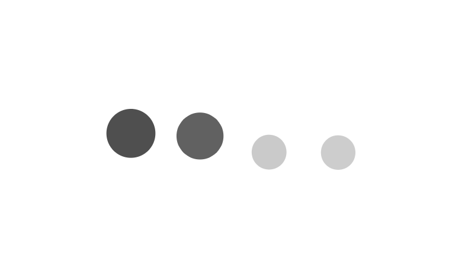

# Effortless Animations in React with Lottie: A Step-by-Step Guide

## Introduction

As developers, we're always searching for ways to elevate user experiences in our web applications. Animations can be a game-changer—they breathe life into interfaces, making them more engaging and intuitive. Yet, implementing high-quality animations often comes with challenges: bloated file sizes, laggy performance, and limited interactivity. This is where **Lottie** steps in.

In this guide, I'll introduce you to **Lottie**, an open-source library that allows you to add delightful, lightweight, and scalable animations to your React apps. By the end of this article, you'll know how to integrate Lottie animations into your project and understand why they're a superior alternative to traditional GIFs or videos.




## The Problem: Why Animations Are Tricky

Animations are a powerful tool for improving user engagement, but they come with inherent challenges:

1. **Performance Issues**  
   GIFs and videos can be resource-intensive, especially on mobile devices or slower networks. They often result in higher page load times and reduced responsiveness.

2. **File Size**  
   High-quality animations (e.g., HD GIFs) tend to be large, bloating your app and increasing bandwidth usage.

3. **Limited Control**  
   Traditional formats like GIFs offer little to no interactivity. You can't pause, reverse, or dynamically adjust their playback.

4. **Cross-Platform Compatibility**  
   Ensuring consistent behavior across web, iOS, and Android apps can feel like an uphill battle.

This is where **Lottie** shines. It uses **JSON-based animation files**, which are lightweight, vector-based, and fully customizable.

## What is Lottie?

Lottie is an open-source animation library developed by Airbnb. It takes animations created in **Adobe After Effects**, exports them as JSON files using the **Bodymovin plugin**, and renders them in your app using platforms like Web, iOS, Android, and React Native.

### Why Choose Lottie?

Here are the key advantages of using Lottie animations:

- **Lightweight**: JSON files are significantly smaller than GIFs or videos.
- **Scalable**: Since animations are vector-based, they look sharp on all screen sizes.
- **Interactive**: You can control playback, loops, speed, and even trigger animations programmatically.
- **Cross-Platform**: The same JSON file works seamlessly across web, mobile, and other platforms.
- **Open-Source**: Free to use with a thriving community of contributors.

## How to Use Lottie in React

Now that we've established why Lottie is awesome, let's dive into how to implement it in a React project.

### Step 1: Install the Required Library

Lottie provides an official React wrapper called **lottie-react**. To install it, run the following command in your project:

```bash
npm install lottie-react
```

If you're working with TypeScript, you might want to install type definitions as well:

```bash
npm install --save-dev @types/lottie-react
```

### Step 2: Add a Lottie Animation to Your Component

Here's a simple example of how to integrate a Lottie animation into your React app:

#### Code Example: Loading Animation Component

```tsx
import { useEffect, useState } from "react";
import Lottie from "lottie-react";

const LottieLoading = () => {
  const [animationData, setAnimationData] = useState(null);

  useEffect(() => {
    // Dynamically import the JSON file
    import("./loading-squares.json")
      .then((data: any) => {
        setAnimationData(data.default);
      })
      .catch(error => console.error("Error loading Lottie JSON:", error));
  }, []);

  if (!animationData) {
    return <p>Loading...</p>; // Fallback UI while JSON is being fetched
  }

  return (
    <div style={{ width: 300, height: 300 }}>
      <Lottie animationData={animationData} loop={true} />
    </div>
  );
};

export default LottieLoading;
```

### Key Features Explained

1. **Dynamic Import**  
   The animation JSON file is loaded dynamically using `import()` inside the `useEffect` hook. This ensures the animation isn't bundled into your main JavaScript file, keeping your app lightweight.

2. **Fallback UI**  
   While the animation data is being fetched, a simple `<p>` tag is displayed as a fallback. This ensures a smooth user experience.

3. **Customizable Playback**  
   The `<Lottie />` component lets you control specific behaviors like looping (`loop={true}`), speed, and even interaction.

### Step 3: Best Practices for Using Lottie

To get the most out of Lottie, follow these tips:

- **Use Vectors**: When creating animations in Adobe After Effects, ensure you're using vector shapes for optimal performance and scalability.
- **Optimize JSON Files**: Before using your animations in production, test and optimize them on [LottieFiles](https://lottiefiles.com/preview).
- **Lazy Load Animations**: Avoid bundling large JSON files with your app; load them dynamically as needed.
- **Interactive Use Cases**: Combine Lottie animations with user interactions (e.g., button clicks or scroll events) to create engaging experiences.

## Real-World Use Case: Interactive Loading Screen

Imagine you're building an e-commerce site. You can use Lottie to implement an interactive loading animation that keeps users engaged while their product search results are being fetched.

### Benefits

- **Boost Engagement**: Users are less likely to bounce during loading screens.
- **Professional Look**: High-quality animations make your app stand out.
- **Performance**: Lottie's lightweight JSON files ensure fast load times.

With the code example above, you can easily implement such a loading screen in your React app.

## Conclusion

Lottie is a game-changing tool for developers looking to integrate high-quality animations into their projects. By leveraging vector-based JSON files and the flexibility of libraries like `lottie-react`, you can create stunning, performant, and interactive experiences for your users.

### Key Takeaways

- Lottie animations are lightweight, scalable, and interactive.
- They work seamlessly across web and mobile platforms.
- Using Lottie in React is straightforward with the `lottie-react` library.

## Call-to-Action

Ready to take your web app to the next level? Start experimenting with Lottie animations today! Whether you're creating captivating loading screens, playful illustrations, or dynamic interactions, Lottie has the tools you need.

Have questions or want to share your experience? Drop a comment below or explore more examples at [LottieFiles](https://lottiefiles.com/).

Happy coding! 🚀
